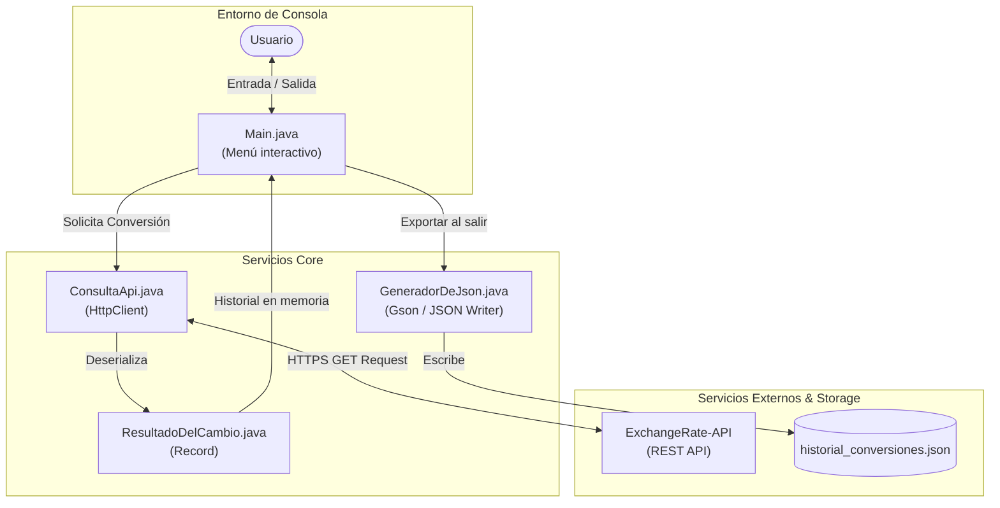

# 💱 Conversor de Monedas CLI - Java 17


> Aplicación de consola robusta desarrollada en **Java 17** que consume una API REST externa para la conversión de divisas en tiempo real, aplica serialización JSON para el historial de transacciones y cuenta con pruebas unitarias parametrizadas.

---

## 📋 Tabla de Contenidos
- [🎯 Descripción y Objetivos](#-descripción-y-objetivos)
- [🏗️ Arquitectura y Flujo de Datos](#️-arquitectura-y-flujo-de-datos)
- [🌐 Integración de API Externa y Postman](#-integración-de-api-externa-y-postman)
- [🧪 Pruebas Unitarias e Integración](#-pruebas-unitarias-e-integración)
- [🚀 Guía de Instalación y Ejecución](#-guía-de-instalación-y-ejecución)
  - [Opción 1: Ejecución Local](#opción-1-ejecución-local-java--maven)
  - [Opción 2: Ejecución con Docker](#opción-2-ejecución-con-docker)
- [📁 Estructura del Proyecto](#-estructura-del-proyecto)
- [🤝 Créditos](#-créditos)

---

## 🎯 Descripción y Objetivos

Este proyecto demuestra buenas prácticas de desarrollo en **Java moderno (Java 17+)**, tales como:
* **Uso de Java Records** (`ResultadoDelCambio`) para inmutabilidad y transferencia de datos sin *boilerplate*.
* **Cliente HTTP nativo** (`java.net.http.HttpClient`) para consumo asíncrono/síncrono de servicios REST.
* **Manejo explícito de excepciones y desacoplamiento** modular entre entrada de consola, servicio HTTP y persisencia de archivos.
* **Persistencia ligera:** Exportación programática a formato JSON para trazabilidad de conversiones.

---

## 🏗️ Arquitectura y Flujo de Datos

### Diagrama de Arquitectura (Mermaid)



### Vista de Flujo Visual


---

## 🌐 Integración de API Externa y Postman

La aplicación se integra con **ExchangeRate-API** para consultar tasas de cambio en tiempo real.

### Endpoint Consumido

```http
GET https://v6.exchangerate-api.com/v6/{API_KEY}/pair/{BASE_CODE}/{TARGET_CODE}/{AMOUNT}
```

#### Ejemplos de Parámetros:
* `BASE_CODE`: Moneda origen (ej. `USD`)
* `TARGET_CODE`: Moneda destino (ej. `COP`, `BRL`, `ARS`)
* `AMOUNT`: Monto numérico a convertir

#### Estructura de Respuesta JSON Esperada:
```json
{
  "result": "success",
  "documentation": "https://www.exchangerate-api.com/docs",
  "terms_of_use": "https://www.exchangerate-api.com/terms",
  "time_last_update_unix": 1700000000,
  "time_last_update_utc": "Thu, 15 Nov 2026 00:00:01 +0000",
  "base_code": "USD",
  "target_code": "COP",
  "conversion_rate": 3950.50,
  "conversion_result": 395050.00
}
```

### 🧪 Pruebas con Postman / cURL
Puedes probar el servicio directamente en tu terminal utilizando cURL:

```bash
curl -X GET "https://v6.exchangerate-api.com/v6/TU_API_KEY/pair/USD/COP/100"
```

---

## 🧪 Pruebas Unitarias e Integración

El proyecto incluye pruebas de calidad de código con **JUnit 5** y **Mockito** para validar la lógica de transformación y la resiliencia ante errores de red.

### Ejemplo de Prueba Unitaria (`ConsultaApiTest.java`)

```java
import org.junit.jupiter.api.Test;
import org.junit.jupiter.api.DisplayName;
import static org.junit.jupiter.api.Assertions.*;
import static org.mockito.Mockito.*;

class ConsultaApiTest {

    @Test
    @DisplayName("Debe lanzar excepción personalizada si la API Key es inválida")
    void debeManejarApiKeyInvalida() {
        ConsultaApi consultaApi = new ConsultaApi("KEY_INVALIDA");
        
        assertThrows(RuntimeException.class, () -> {
            consultaApi.convertirMoneda("USD", "COP", 100);
        });
    }

    @Test
    @DisplayName("Debe calcular correctamente la conversión con un Record simulado")
    void debeValidarEstructuraRecord() {
        ResultadoDelCambio resultado = new ResultadoDelCambio("USD", "ARS", 100.0, 950.5, 95050.0);
        
        assertEquals("USD", resultado.baseCode());
        assertEquals(95050.0, resultado.conversionResult());
    }
}
```

### Ejecutar las Pruebas
```bash
mvn test
```

---

## 🚀 Guía de Instalación y Ejecución

### Requisitos Previos
* **Java SDK 17** o superior.
* **Maven** (opcional, para gestión de dependencias y pruebas).
* **API Key gratuita** de [ExchangeRate-API](https://www.exchangerate-api.com/).

---

### Opción 1: Ejecución Local (Java / Maven)

1. **Clonar el repositorio:**
   ```bash
   git clone https://github.com/SamySierraDV/AluraLatam-Conversor-de-monedas.git
   cd AluraLatam-Conversor-de-monedas
   ```

2. **Compilar el proyecto:**
   ```bash
   javac -d bin src/*.java
   ```

3. **Ejecutar la aplicación:**
   ```bash
   java -cp bin Main
   ```

4. **Ingresar la API Key:** Al iniciar la aplicación, se solicitará la clave para consultar el servicio en vivo.

---

### Opción 2: Ejecución con Docker

Si prefieres no instalar un entorno Java local, puedes compilar y ejecutar el proyecto mediante **Docker**.

#### 1. Construir la Imagen Docker
Crea la imagen localmente ejecutando:

```bash
docker build -t conversor-monedas:1.0 .
```

#### 2. Ejecutar el Contenedor Interactivo
Como la aplicación interactúa mediante la consola (`stdin`/`stdout`), se debe utilizar la bandera `-it`:

```bash
docker run -it --rm name conversor-app conversor-monedas:1.0
```

---

## 📁 Estructura del Proyecto

```text
AluraLatam-Conversor-de-monedas/
│
├── .github/                 # Workflows de CI/CD (GitHub Actions)
├── src/
│   ├── Main.java            # Punto de entrada y menú interactivo CLI
│   ├── ConsultaApi.java     # Cliente HTTP REST para ExchangeRate-API
│   ├── ResultadoDelCambio.java # Java Record DTO
│   └── GeneradorDeJson.java # Persistencia de historial a JSON
│
├── test/
│   └── ConsultaApiTest.java # Pruebas unitarias con JUnit 5 & Mockito
│
├── Dockerfile               # Configuración para contenedor Docker
├── pom.xml                  # Configuración de dependencias (Maven)
└── README.md                # Documentación principal
```

---

## 🤝 Créditos

Proyecto desarrollado por **Samy Sierra Suárez** como parte de la formación **Oracle Next Education (ONE) G9 – Java & Back-End** en alianza con **Alura Latam**.

* GitHub: [@SamySierraDV](https://github.com/SamySierraDV)
* [](https://www.linkedin.com/in/samy-sierra-dev)
